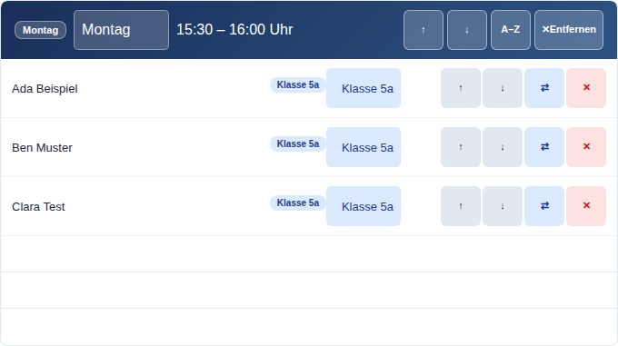
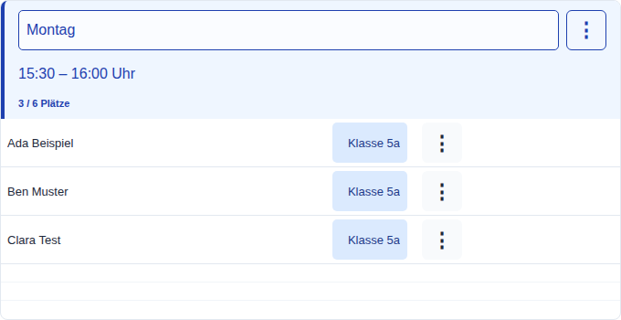
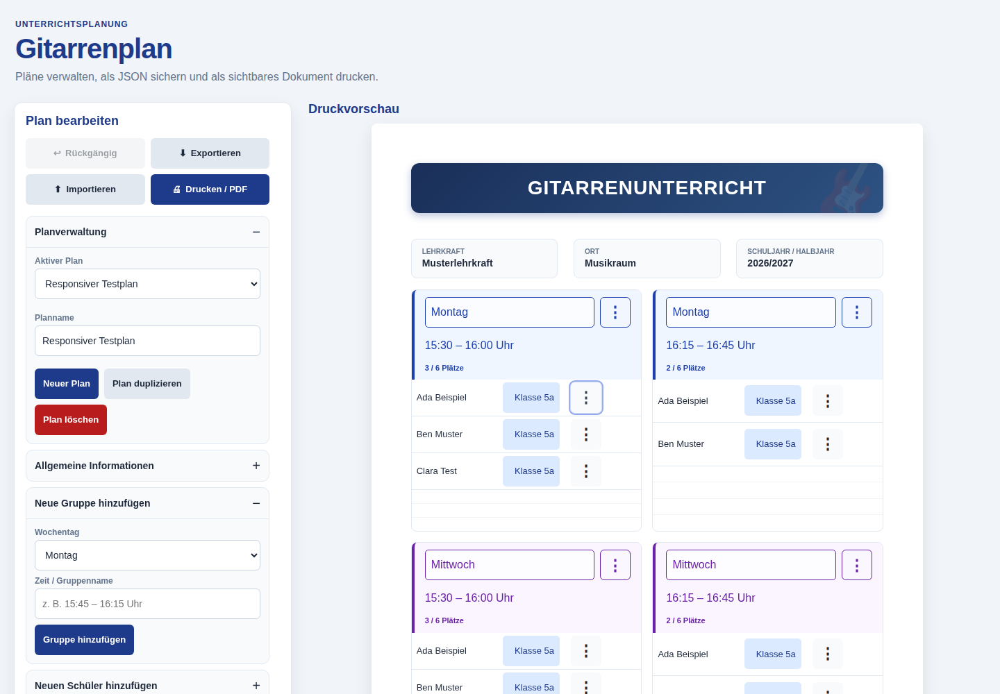
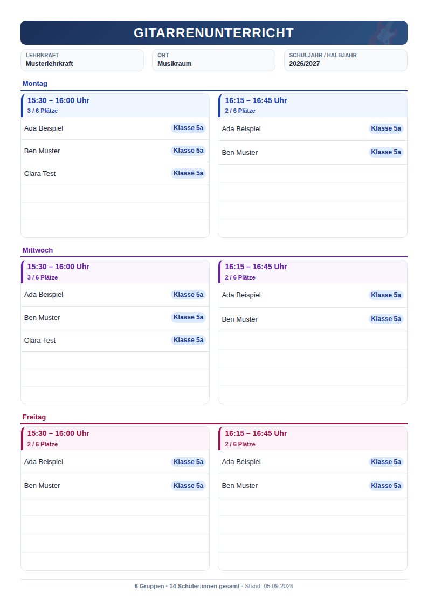

# Editor und Druckübersicht: Umsetzung und Belege

Ausgangsstand: `d6898a34478e0402eb14844ca6427e2c12979468` auf `main`.
Geprüfter Anwendungsstand: `b4efacd9f6440dc6e2ace418c4fb1270c0885533`.
Die Belege enthalten ausschließlich synthetische Testdaten.

## A: Verifizierte Bugs

Die Stylesheets werden in `index.html` als `base`, `editor`, `preview`, `print`,
`responsive` geladen. Die späteren Regeln `.day-badge` und `.class-badge`
überschrieben das gleich spezifische `.print-only` durch `display: inline-block`.
Der Entfernen-Button enthielt zwei direkt benachbarte Spans ohne Abstand.

`css/base.css` versteckt jetzt alle `.print-only`-Elemente im Bildschirmmedium
mit `display: none !important`. Der Vertrag deckt auch Schülernamen,
Gruppenzeiten und die neuen Tagesüberschriften mit eigenem Grid-Display ab.
Der Browser-Test prüft sämtliche Druckelemente, auch nach einer zusätzlich
eingefügten konkurrierenden Display-Regel. Die Druckregeln bleiben sichtbar.

Alle `.button`-Elemente verwenden `inline-flex`, vertikale Zentrierung und
`gap: 6px`. Der gemessene Abstand zwischen den Entfernen-Spans beträgt vorher
0 px, anschließend 6 px. Nachher ist der Button im geöffneten Aktionsmenü zu sehen.

| Vorher: tatsächlicher Ausgangs-Commit | Nachher |
| --- | --- |
|  |  |
|  |  |

## B: Arbeitsbereich

- App-Shell maximal 1440 px; ab 1180 px zwei Spalten mit 400 px breitem Editor.
- Native aufklappbare Editorbereiche; das haftende Panel bleibt innerhalb des
  sichtbaren Bereichs und kann bei Bedarf separat gescrollt werden.
- Über 900 px behält jede Vorschauseite ihre 210 mm Breite. Ein äußerer Rahmen
  reserviert die skalierte Breite und Höhe; `ResizeObserver` aktualisiert ihn.
  Kleinere Bildschirme verwenden weiterhin eine fließende, gestapelte Ansicht.
- Gruppen- und Schüleraktionen sind über native, beschriftete Menüs erreichbar.
  Tab, Escape, Außenklick und Fokuswiederherstellung sind berücksichtigt.
  Mindestgrößen werden invers zur Skalierung angepasst, sodass die sichtbaren
  Ziele mindestens 44 px groß bleiben.

[Mobile Gruppenansicht](evidence/06-mobil.png)

## C: Gedrucktes Dokument

Tagesfarben kennzeichnen Gruppen dezent. Tagesnamen bleiben auch ohne Farbe
lesbar; freie Tagesnamen erhalten eine neutrale Farbe. Benachbarte Slots
desselben Tages teilen eine Überschrift über beide Spalten. Gemischte Tage
behalten ihre eigene Beschriftung; die manuelle Reihenfolge bleibt erhalten.

Die Belegung lautet `Schülerzahl / max(Schülerzahl, Mindest-Zeilen) Plätze`.
Mindest-Zeilen sind keine Obergrenze. Gesamtzahlen zählen logische Gruppen und
Schüler nur einmal, auch wenn eine Gruppe auf Fortsetzungssegmente verteilt ist.
Leere Zeilen sind niedriger und haben hellere Trennlinien. Die kompakte
Druckansicht verwendet kleinere Zeilenabstände bei unveränderten Schriftgrößen.

`@page A4 portrait` und die gedruckten Maße 210 × 297 mm bleiben erhalten.
Im Druck werden Skalierung und äußere Bildschirm-Rahmenmaße ausdrücklich
zurückgesetzt. Drucken speichert offene Eingaben weiterhin synchron.

[Echte Beispiel-PDF](evidence/gitarrenplan-beispiel.pdf) ·
[Druckprüfung mit langen Inhalten](evidence/08-druck-lang.png)

## Prüfung

[Erfolgreicher CI-Lauf](https://github.com/sl3ndrr/gitarrenplan/actions/runs/33956605012):

| Prüfung | Ergebnis |
| --- | --- |
| ESLint | Erfolgreich |
| Vitest / jsdom | 68 Tests in 10 Dateien erfolgreich |
| Playwright / Chromium | 29 Browser-Tests erfolgreich |
| PDF-Erzeugung | 1 Test mit 12 Beispieldateien erfolgreich |
| Poppler | 15 A4-Seiten: Maße, Seitenzahlen, Pflichttexte und vollständige PNGs geprüft |
| Bildschirmbreiten | 320, 375, 768, 900, 1024, 1180, 1280, 1440 px |
| Visuelle Abnahme | Vorher/Nachher, Desktop, Mobilansicht, Tagespaare, lange Inhalte, Leerplan und Fortsetzungen geprüft |

Die bestehenden Tests für Undo, gruppierte Texteingaben, Fokus, LocalStorage,
Import/Export, Mehrtab-Konflikte und den synchronen Druckabschluss bestehen.
State, Commands, Persistenz, Datenformat und Paginierung wurden nicht verändert.
Globales Redo war im Ausgangscode nicht implementiert; globales Undo und native
Tastenkombinationen in Textfeldern bleiben erhalten.

Die Screenshots lassen sich mit `npm run test:browser` reproduzieren. Der
Ausgangs-Commit muss in der lokalen Git-Historie vorhanden sein. Alle zwölf PDFs
und deren Renderings entstehen mit `npm run test:pdf` unter `output/pdf`.
